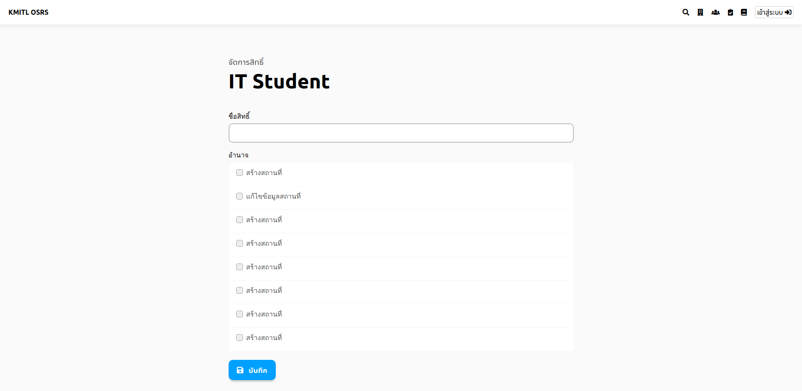

# ตั้งการอนุญาติให้กับกลุ่มผู้ใช้งาน

## ขั้นที่ 1 กดปุ่มจัดการสิทธิ์

## ขั้นที่ 2 ดูรายการผู้ใช้
แล้วกดเข้าไปที่ผู้ใช้ที่ต้องการ

## ขั้นที่ 3 เลือกสิทธิ์ให้ผู้ใช้
เมื่อกดเลือกสิทธิ์แล้ว ก็สามารถกดบันทึกเพื่อยืนยันการแก้ไขข้อมูลได้ ตามภาพที่ 3

*ภาพที่ 3 - หน้าจอการเลือกสิทธิ์ผู้ใช้งาน*
