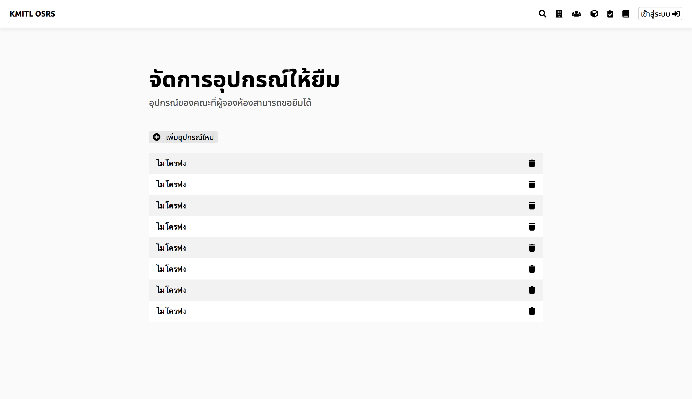

# ตั้งสถานะการให้ยืมอุปกรณ์

## ขั้นที่ 1 - กดปุ่มจัดการอุปกรณ์ให้ยืม

## ขั้นที่ 2 - กดเข้าไปที่อุปกรณ์
เพื่อทำการแก้ไขสถานะ

## ขั้นที่ 3 - แก้ไขสถานะอุปกรณ์
โดยการกดปุ่ม สามารถใช้งานได้ หรือ ไม่สามารถใช้งานได้
