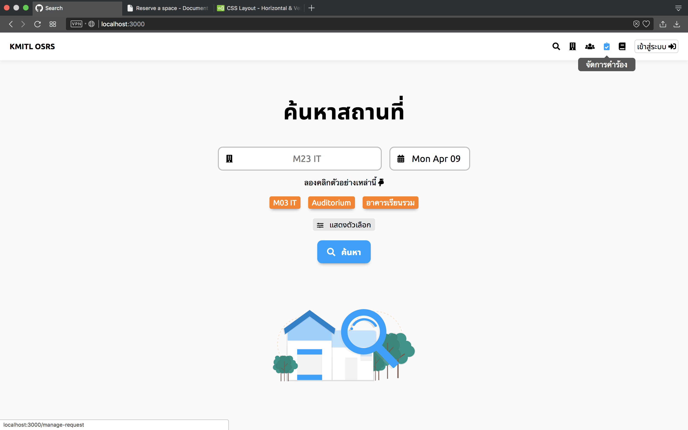
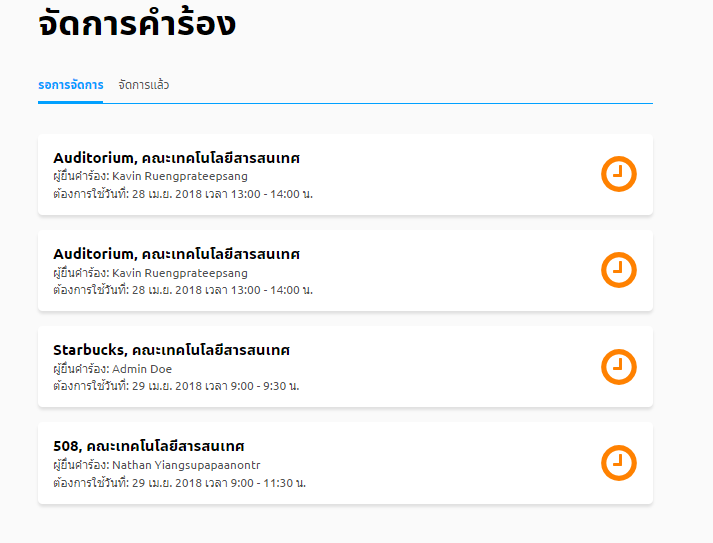
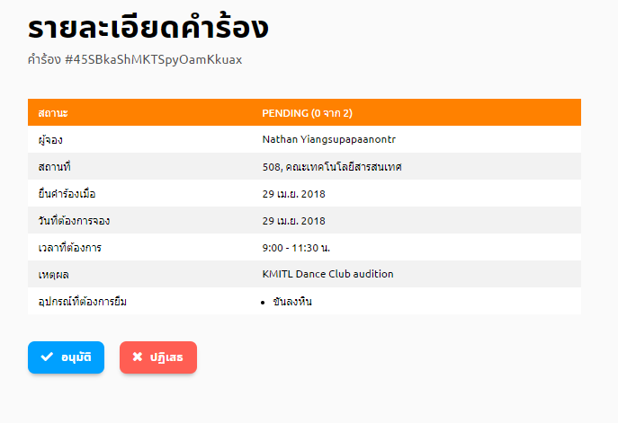

# อนุมัติการใช้สถานที่
> เฉพาะผู้อนุมัติเท่านั้นจึงอนุมัติการใช้สถานที่ได้

## 1. กดปุ่มจัดการคำร้อง
 
## 2. กดคำร้องที่รอการจัดการ
เมื่อทำขั้นตอนที่1แล้ว หน้าจอจะแสดงแถบคำร้องที่รอการจัดการอยู่ 
  
## 3. ดูรายละเอียดคำร้อง
เลือกคำร้องที่ต้องการอนุมัติ 
  
 

## 3. กดปุ่มอนุมัติ

> บางคำร้องอาจต้องการผู้อนุมัติมากกว่า 1 คน การอนุมัติจึงจะเสร็จสมบูรณ์
