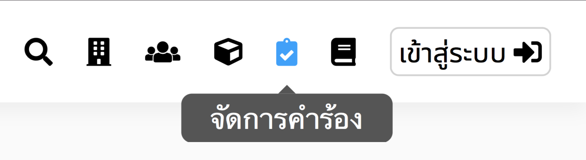
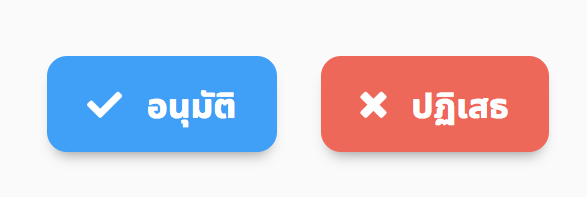

# ปฏิเสธคำร้องการใช้สถานที่
> เฉพาะผู้อนุมัติเท่านั้นจึงปฏิเสธคำร้องการใช้สถานที่ได้

## 1. กดปุ่มจัดการคำร้อง

  หน้าจอจะแสดงแถบคำร้องที่รอการจัดการอยู่
  

## 2. กดคำร้องที่รอการจัดการ

## 3. กดปุ่มปฏิเสธ

