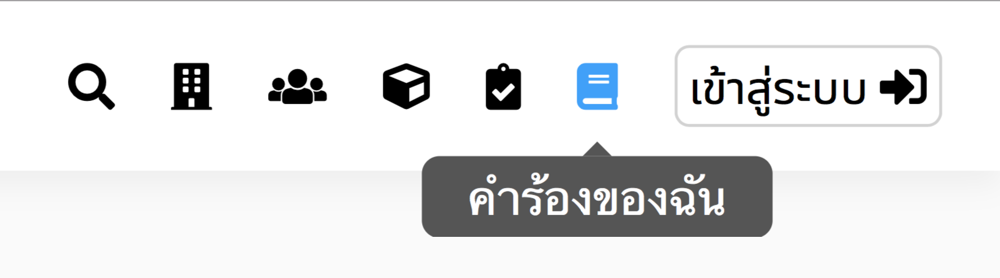

# ยกเลิกการขอใช้สถานที่

> ผู้ยื่นจองสามารถยกเลิกการจองได้ก่อนจะถึงช่วงเวลาที่จองไป 
ถ้าต้องการยกเลิกการจอง เมื่อถึงช่วงเวลาที่จองไปแล้ว, กรุณาติดต่อเจ้าหน้าที่ฝ่ายบริการการศึกษา 
> การยกเลิกการขอใช้สถานที่ ผู้ใช้จำเป็นต้องเข้าสู่ระบบ

## ขั้นที่ 1 - กดปุ่มคำร้องของฉัน
กดปุ่มคำร้องของฉัน จากแถบนำทาง

## ขั้นที่ 2 - เลือกการจองที่ต้องการแก้ไข

## ขั้นที่ 3 - กดปุ่มยกเลิก
เพื่อเริ่มกระบวนการยกเลิก
หมายเหตุ : หลังการยกเลิก, การจองของผู้จองจะถูกยกเลิกทันที. กรุณาตรวจสอบให้แน่ใจว่าต้องการยกเลิกจริงๆ

## ขั้นที่ 4 - กดปุ่มยืนยัน
