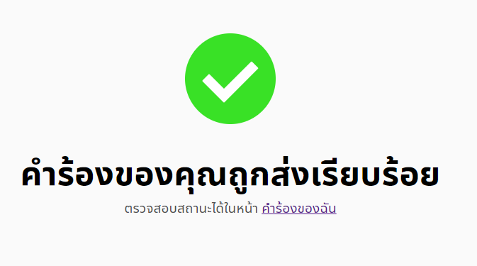

# ดูสถานะการขอใช้สถานที่
> ต้องเข้าสู่ระบบก่อน
## 1. เข้าหน้าคำร้องของฉัน
  กดปุ่มคำร้องของฉันที่อยู่ด้านขวาบนของจอ ในแถบนำทาง มีลักษณะเป็นรูปหนังสือ 
     
  หรือเมื่อทำการจองเสร็จก็สามารถกดไปยังหน้าคำร้องของฉันได้จาก คำสีฟ้าที่ขีดเส้นใต้ไว้จากภาพ้านล่าง
     
  ดูสถานะคำร้องได้ มี 4 สถานะ คือ อนุมัติ ปฏิเสธ รอการอนุมัติ และ ยกเลิก 
   
  สีเขียว คือ อนุมัติแล้ว 
  สีเหลือง รูปนาฬิกา คือ รออนุมัติ 
  สีแดง แยกเป็น 2 สถานะ ถ้าในคำร้องบอกว่า FAILED คือคำร้องถูกผู้อนุมัติปฏิเสธ แต่ถ้าเป็น CANCELLED แสดงว่าผู้ใช้ยกเลิกคำร้องนั้น 
> ดูรายละเอียดคำร้อง : กดคำร้องเพื่อดูรายละเอียดคำร้องนั้นโดยละเอียด ตัวอย่างดังภาพด้านล่าง 
  
