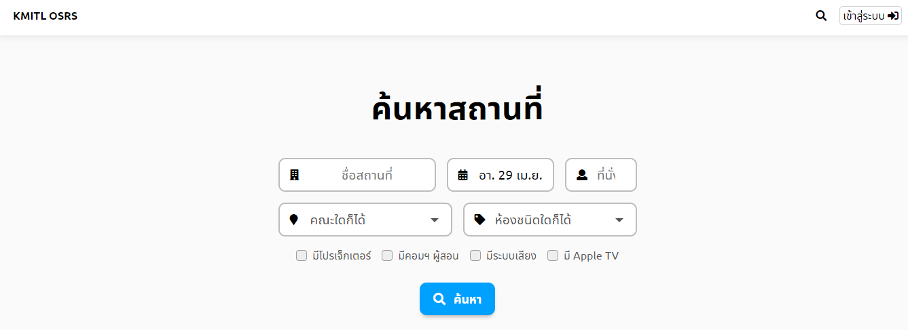
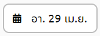
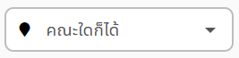

# ค้นหาสถานที่
## 1. เข้าสู่เว็บไซต์
   เข้าสู้เว็บไซต์ระบบจองสถานที่ออนไลน์ โดยการใช้เมาส์กดตรงนี้ >> https://space.itforge.io/
     เมื่อกดเข้าไปจะเจอเว็บไซต์หน้าตาดังภาพด้านล่าง
   
## 2. ระบุรายละเอียด
> หากไม่ต้องการระบุรายละเอียด สามารถข้ามไปยังขั้นตอนที่3 ซึ่งจะเป็นการค้นกาสถานที่จากสิ่งที่ระบบกำหนดไว้ให้เบื้องต้น
   หัวข้อรายละเอียดที่สามารถระบุมีดังนี้:
> สามารถระบุเฉพาะหัวข้อที่ต้องการ แล้วไปยังขั้นตอนที่3 ได้เลย
   1.ระบุชื่อสถานที่  
   
   2.ระบุวันเดือนปี  
   
   3.ระบุจำนวนที่นั่งที่ต้องการใช้   
   
   4.ระบุคณะ  
   
   5.ระบุประเภทห้อง   
   
   6.ระบุอุปกรณ์ของห้องที่ต้องการใช้  
   
## 3. กดปุ่มค้นหา
   
   เมื่อกดปุ่มค้นหาแล้ว จะขึ้นเป็นแถบห้องต่างๆที่ตรงกับข้อมูลที่ผู้ใช้ระบุ
   สามารถกดเข้าไปเพื่อดูรายละเอียดห้องและจองห้องได้
> หากอยู่ในหน้าอื่น แล้วต้องการมายังหน้าค้นหาสถานที่ สามารถกดได้ที่ ปุ่มรูปแว่นขยาย  หรือ ปุ่มKMITL OSRS 
