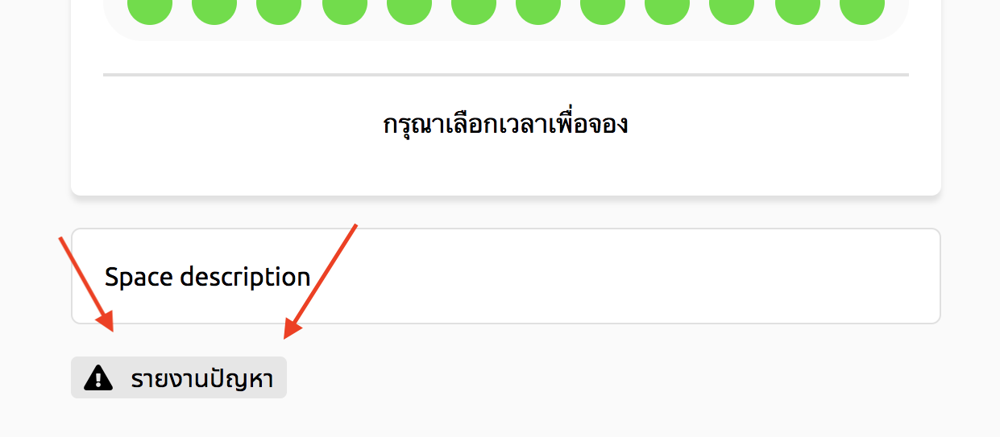

# แจ้งปัญหาของสถานที่
> ผู้ใช้งานต้องเข้าสู่ระบบ และ ค้นหาสถานที่ก่อน

## 1. กดปุ่มรายงานปัญหา
ปุ่มรายงานปัญหาอยู่ด้านล่างสุดของหน้ารายละเอียดห้อง

## 2. กรอกข้อมูลปัญหา
กรอกหัวข้อปัญหา และ รายละเอียดปัญหา แล้ว กดปุ่มส่งรายงาน

