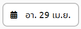

# จองสถานที่
## 1. เลือกวันเดือนปี
 
โดยการกดเข้าไปในช่องนี้ จะปรากฎปฏิทินให้เลือก วัน เดือน ปี ที่สามารถจองได้
## 2. เลือกช่วงเวลา
บนหน้าจอจะแสดงแถบช่วงเวลาทั้งหมดในวันที่เลือก 
 
3 สีบนแถบแสดงช่วงเวลามีความหมายดังนี้  
1.สีแดง - ช่วงเวลาที่ไม่สามารถจองได้ 
2.สีเขียว - ช่วงเวลาที่สามารถจองได้ 
3.สีฟ้า - ช่วงเวลาที่ผู้ใช้ต้องการจอง (โดยช่วงสีฟ้านี้เกิดจากการเลือก ช่วงเวลาเริ่มต้น และ ช่วงเวลาสิ้นสุด)  
การกำหนดช่วงเวลาเริ่มต้น และ สิ้นสุดสามารถทำได้โดยกดไปยังตัวเลขบนช่องช่วงเวลาเริ่มต้น หรือ สิ้นสุด 
   
กดที่เลขชั่วโมงจะปรากฎนาฬิกาให้เลือกเลขชั่วโมงดังนี้ 
 
ผู้ใช้สามารถเลือกเลขชั่วโมงที่มีอยู่บนนาฬิกาได้โดยเลื่อนเม้าส์ไปคลิกที่เลขชั่วโมงที่ต้องการเป็นอันสำเร็จ 
กดที่เลขนาทีจะปรากฎนาฬิกาให้เลือกเลขนาทีสองเลขได้แก่ 00 และ 30 ซึ่งหมายถึงเวลา 0 นาที และ 30 นาที 
 
ผู้ใช้สามารถเลือกเลขนาทีที่มีอยู่บนนาฬิกาได้โดยเลื่อนเม้าส์ไปคลิกที่เลขนาทีที่ต้องการเป็นอันสำเร็จ 
เมื่อกำหนดทั้งเลขชั่วโมงและนาทีแล้วจะปรากฎช่วงเวลาที่ต้องการบนช่อง ช่วงเวลาเริ่มต้น หรือ สิ้นสุด
## 3. กดปุ่มจอง
 
 > ต้องการการเข้าสู่ระบบ
## 4. กรอกรายละเอียด
 จำเป็นต้องกรอกเหตุผลในการจอง 
  
## 5. เลือกอุปกรณ์เพิ่มเติม
 หากต้องการอุปกรณ์เพิ่มเติม สามารถกดเลือกอุปกรณ์ที่ต้องการยืมเพิ่มเติม นอกจากที่ปกติมีให้ได้ จากตัวเลือกที่กำหนด ซึ่งจะแตกต่างกันไปในแต่ละห้อง 
  
## 6. กดปุ่มส่งข้อมูล
  
 > เมื่อกดปุ่มส่งข้อมูลแล้วระบบจะแจ้งเตือนว่าคำร้องถูกส่งไปยังผู้อนุมัติแล้ว 
   
