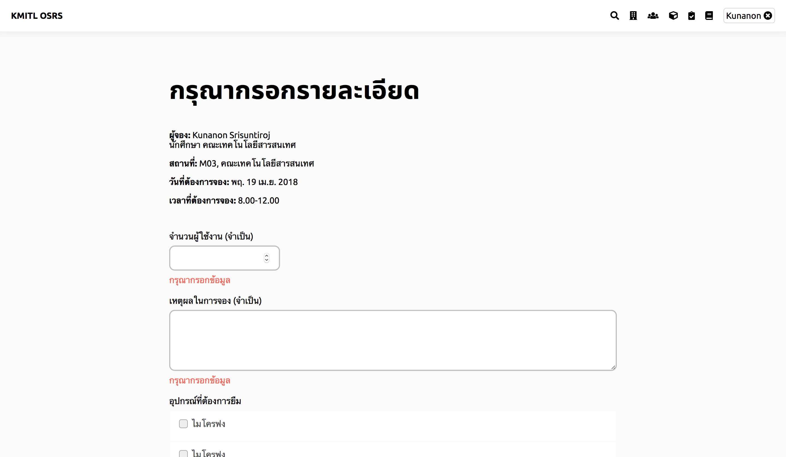

# จองสถานที่
> ก่อนการจองสถานที่ ผู้ใช้จำเป็นต้องค้นหาสถานที่ก่อน โดยรายละเอียดวิธีการค้นหาอยู่ในหัวข้อ ค้นหาสถานที่ ของคู่มือการใช้งาน  

> เมื่อเข้าสู่หน้าสถานที่ที่ต้องการจองแล้ว จะปรากฎรายละเอียดของสถานที่นั้นเพื่อประกอบในการตัดสินใจ ประกอบด้วย ชื่อสถานที่ ชื่อคณะ รูปภาพสถานที่(ภาพที่ 0.1) จำนวนที่นั่งที่รองรับ และอุปรณ์ที่มีให้ภายในห้อง ซึ่งสามารถใช้ได้โดยไม่ต้องขอยืม (ภาพที่ 0.2)

## ขั้นที่ 1 - เปลี่ยนวันเดือนปี
ในหน้านี้จะมีช่องปฏิทินซึ่งระบุวันที่ตามที่ผู้ใช้ระบุเมื่อค้นหา  

แต่หากต้องการเปลี่ยนวันเดือนปีก็สามารถกดเข้าไปที่ช่องปฏิทิน1ครั้ง แล้วปฏิทินจะปรากฎขึ้นมา  

และสามารถเลือกวันเดือนปีอื่นที่ทางระบบกำหนดให้เลือกได้ โดยรายละเอียดของการเลือกวันเดือนปี จะอยู่ในหัวข้อ ค้นหาสถานที่

## ขั้นที่ 2 - เลือกช่วงเวลา
ใต้ปฏิทิน จะมีแถบเวลาในวันที่เลือก ลักษณะเป็นวงกลมหลายๆวง โดยวงกลมแต่ละวงเท่ากับช่วงเวลาครึ่งชั่วโมง และมีเลขช่วงเวลากำกับอยู่ด้านบน เลขโดดคือเวลาชั่วโมง และ .30 คือครึ่งชั่วโมงจากวงกลมก่อนหน้า  

ช่วงเวลาที่สามารถจองได้จะเป็นวงกลมสีเขียว และ ช่วงเวลาที่ไม่สามารถจองได้จะเป็นวงกลมสีแดง  

หากต้องการของครึ่งชั่วโมงให้กดที่วงกลมของช่วงเวลานั้นเพียงวงเดียว แล้ววงกลมนั้นจะเปลี่ยนเป็นสีฟ้า ซึ่งแสดงว่าปัจจุบันผู้ใช้เลือกช่วงเวลานี้อยู่  

แต่หากต้องการจองมากกว่าครึ่งชั่วโมงให้กดที่วงกลมสีเขียวที่เป็นช่วงเวลาแรกที่ต้องการจอง  

และวงกลมสีเขียวอีกวงที่ไม่มีวงกลมสีแดงมาคั่นเพื่อเป็นการจองในระยะเวลาจากวงกลมแรกถึงวงกลมที่สอง โดยเมื่อกดทั้งสองวงแล้ว วงกลมทั้งหมดที่อยู่ภายในวงกลมองวงนี้จะเป็นสีฟ้าไปด้วย ซึ่งเป็นการแสดงช่วงเวลาที่ผู้ใช้ต้องการจอง  

## ขั้นที่ 3 - จอง
เมื่อเลือกเวลาซึงวงกลมเป็นสีฟ้า แล้วปุ่มจองจะปรากฏขึ้น ปุ่มมีลักษณะเป็นสีฟ้ารูปดินสอ ถ้าผู้ใช้ต้องการจองช่วงเวลาที่เลือกไว้ ให้กดที่ปุ่มจองเพื่อดำเนินการต่อ (ภาพที่ 3.1) 

เมื่อกดปุ่มจองแล้ว จะเข้าสู่หน้ากรอกรายละเอียดการจอง ซึ่งการจองส่วนมากต้องการมากกว่าวันที่ เวลา และสถานที่ ในการจองจำเป็นต้องมีเหตุผลในการจองด้วย นี่เป็นส่วนสำคัญในการตัดสินใจอนุมัติของผู้อนุมัติ (ภาพที่ 3.3) 

> เพิ่มเติม:
> ข้อมูลของผู้จอง เช่น เบอร์โทรศัพท์จะถูกส่งให้กับเจ้าหน้าทที่พร้อมกับการจอง เพื่อให้สามารถตามเรื่องได้ หากเกิดปัญหาภายหลังการใช้งาน

ในหน้านี้ให้กรอกรายละเอียดการจอง เสร็จแล้วกดปุ่ม ส่งข้อมูล

## ขั้นที่ 4 - รอการอนุมัติ
เข้าสู่ระบบเพื่อดูรายการการจองของผู้ใช้ เมื่อกดดูรายการการจองจะเห็นแถบการจองที่ผู้ใช้จองไป และ สถานะการอนุมัติ ถ้าเป็นรูปนาฬิกาแสดงว่าอยู่ในขั้นตอนการรออนุมัติ (ภาพที่ 4.1) 

และเมื่อได้รับการอนุมัติแล้ว จะสามารถใช้ห้องที่จองได้ตามเวลาที่จอง โดยไม่ต้องทำอะไรเพิ่มเติม
