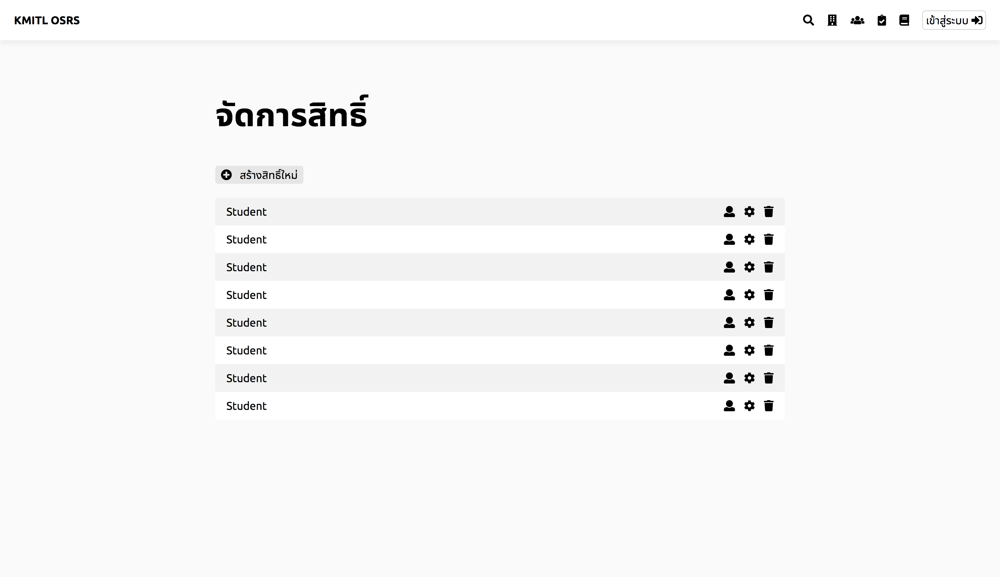

# Add a role
Administrator can add a role into the service. 
Adding a role creates the group of user that administrator can put a permission to. 
This is another method to manage bulk size of user.

## Step 1 - Go to manage permission page
Click the manage permission button in the navigation bar.

*Exhibit A - Manage role and permission button in navigation bar*

and it will redirect you to manage role and permission page.

## Step 2 - Go add a new role
The report will show a role list. 
You can create a new role, delete a role or modify a permission of a role and user list in a role inside this page (as in Exhibit B).

*Exhibit B - Role report*

Click "add" button to add a new role

*Exhibit C - Add new role button*

## Step 3 - Type in a new role
By clicking that button, the form will be shown (as Exhibit C).  
Typing the role name in that form then press `ENTER` will add a role for you.

*Exhibit D - Add new role form. Type in your new role name and press ENTER*

a new role will be shown with other role.
