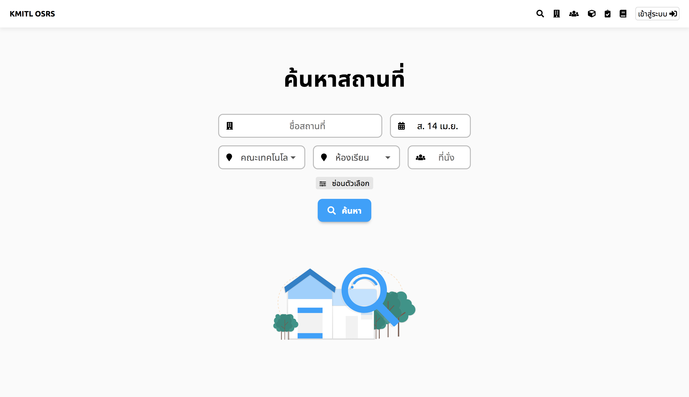
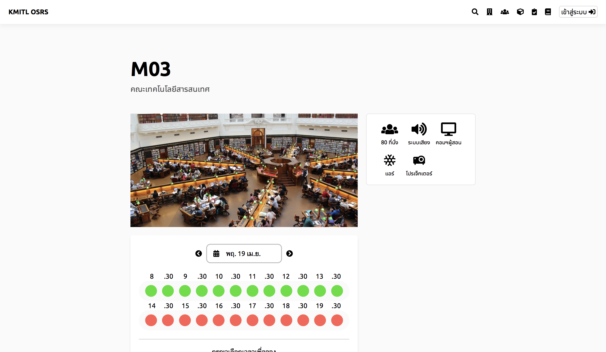

# เลือกพื้นที่ว่าง

## ขั้นที่ 1 - ไปยังหน้าค้นหา
กดปุ่มค้นหาเพื่อเข้าสู่การค้นหา. 
หมายเหตุ : หน้าเริ่มต้นเป็นหน้าค้นหา.

## Step 2 - ค้นหาพื้นที่ว่าง
พิมพ์ชื่อห้องที่ต้องการจอง 
หรือเริ่มด้วยการใส่เฉพาะวันที่จะจอง

ถ้าคุณมีรายละเอียดของห้องเพิ่มเติม สามารถกดค้นหาขั้นสูงได้

> หมายเหตุ : คุณต้องใส่**อย่างน้อย** 1 ช่องที่มีให้ในการค้นหาขั้นสูงYou need to enter 
คุสามารถใส่ข้อมูลในช่องอื่นเพิ่มเติมได้ในภายหลัง

หลังจากใส่ข้อมูลเท่าที่ต้องการแล้ว, กดค้นหาเพื่อดำเนินการต่อ

## ขั้นที่ 3 - Modifying search preference
ระบบจะแสดงหน้าผลการค้นหา 
กดที่บัตรเพื่อแสดงข้อมูลพื้นที่เพิ่มเติม หรือกดเพื่อเริ่มการจอง

> หมายเหตุ : คุณสามารถเปลี่ยนข้อมูล (เพิ่ม, แก้ไข หรือ ลบ) ได้ทุกเวลา.  
กดค้นหา เพื่อค้นหาพื้นที่ตามข้อมูลที่เปลี่ยนใหม่.

## ขั้นที่ 4 - ดูข้อมูลพื้นที่ และ การแจ้งเตือน
กดบัตรพื้นที่การจองที่แสดงบนจอ เพื่อดูรายละเอียดข้อมูลพื้นที่นั้น. 
พื้นที่ที่ไม่ใช่ที่สาธารณะ,ต้องการการเข้าสู่ระบบ

หน้านี้บอกข้อมูล ของสิ่งที่มีภายในห้องนั้นๆ ซึ่งสามารถใช้ได้โดยไม่ต้องขอเพิ่ม

ผู้ใช้ที่เป็นผู้ดูแลจะสามารถเพิ่มข้อมูลพื้นที่ได้ตลอดเวลา.

