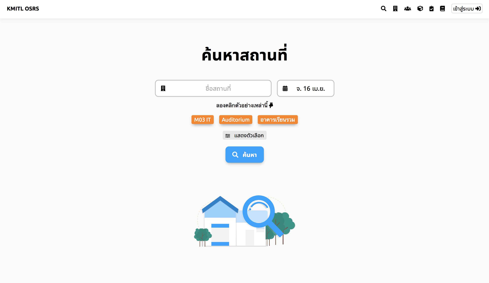

# Search for available space

## Step 1 - Search for available Space
In the landing page, type in a name of the space that you want to reserve.

*Exhibit 1 : Search bar **without** filter on*

If you don’t have any space preferences or want to choose a space based on Faculty building, room name or number of seats, click advance to reveal more options.

*Exhibit 2 : Search bar **with** filter on*

Note : you need to enter 1 of the 5 filter in order to continue. You may add more filters afterward.

After filling the filter, click “Search” button to continue.

## Step 2 - Modifying search preference
Result that match your filter will come up. You may click at the card to see more information about the room, or to reserve this room.

Note : You may change your filter (adding, modifying and remove your filter) at any time. You will need to click Search to confirm your new search filter.

## Step 3 - View space information and notices
By clicking the result card, it will leads to a space information page.

*Exhibit 3 : Overall room information*

It gives user a freedom to see information like audio equipment, computer equipment, type of space, available seats (for space that is room and conference room) and many other information.

*Exhibit 4 : Room amenity*

User with administration permission can add more information about the space at anytime.

At the bottom of the page, you can start reserve that space. Time that is count as available will be marked in Green. User can click or swipe the time you want to reserve and click the calendar to change a date of reservation.

Clicking continue will continue the reservation process with time, date, space as you select. Signing in is required in order to continue the process.
