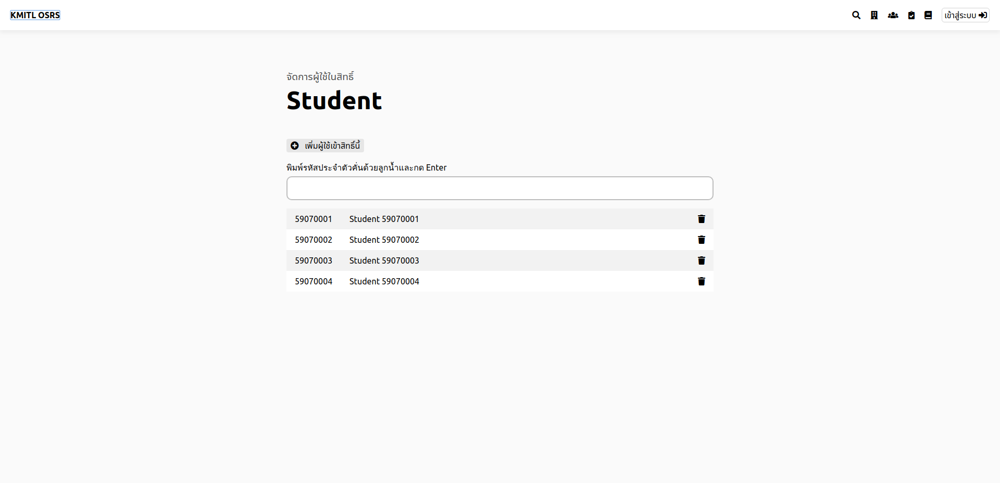

# แก้ไขข้อมูลผู้ใช้งาน
## ขั้นที่ 1 เข้าหน้าจัดการสิทธิ์

## ขั้นที่ 2 กดเลือกกลุ่ม ที่จะเพิ่มผู้ใช้เข้าไป

## ขั้นที่ 3 กดปุ่มเพิ่มผู้ใช้เข้าสิทธิ์ หรือกดปุ่มถังขยะเพื่อลบผู้ใช้ออกจากสิทธิ์
เพื่อจัดเข้ากลุ่ม แล้วพิมพ์รหัสประจำตัวที่จะเพิ่ม  
ถ้ามีหลายคนให้คั่นด้วยลูกน้ำ เมื่อรบแล้วแล้วกด Enter  
หากต้องการลบผู้ใช้ออกจากสิทธิ์ กดรูปถังขยะ

