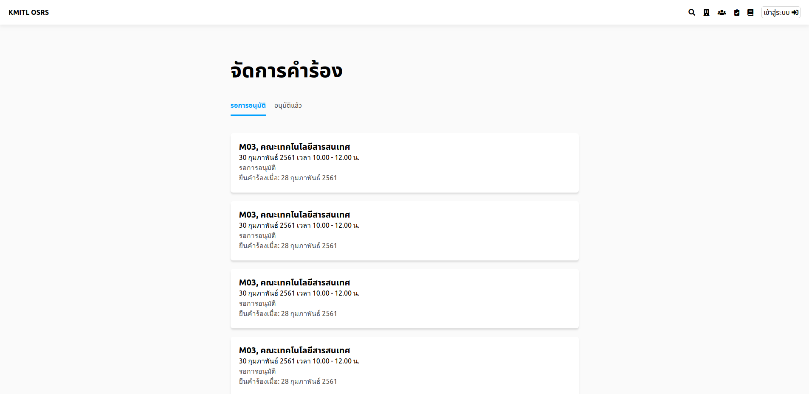

# อนุมัติการใช้สถานที่

## ขั้นที่ 1 - ไปยังรายการการจอง
กดปุ่มจัดการคำร้อง

ดูรายการคำร้อง

ดูรายละเอียดคำร้อง เพื่อเป็นส่วนในการตัดสินใจ

## ขั้นที่ 2 - อนุมัติการจอง
กดปุ่ม อนุมัติ

## ขั้นที่ 3 - พิมพ์รหัสผ่านผู้ใช้เพื่อยืนยันการอนุมัติ และทำให้อนุมัติเป็นผล

