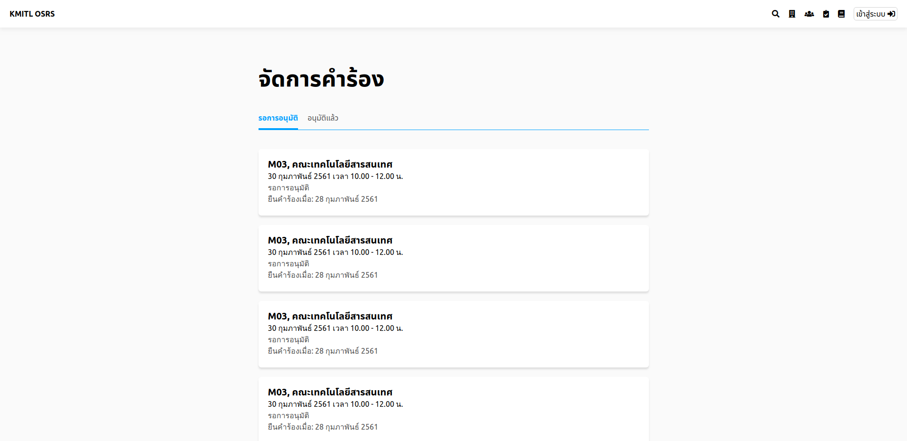
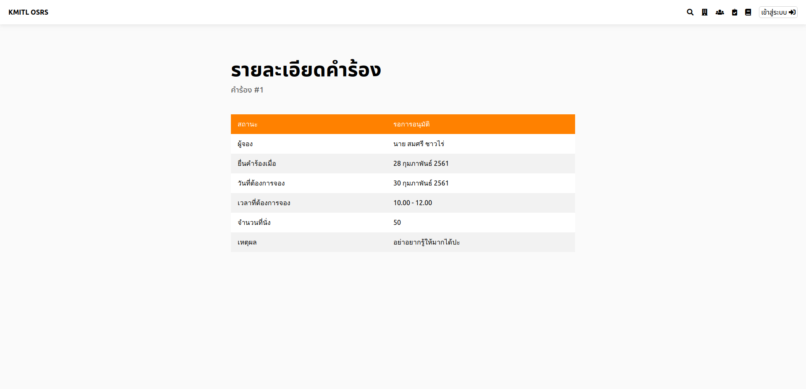
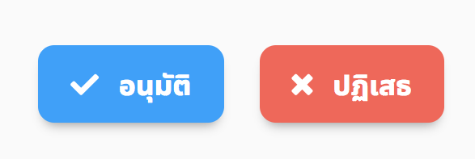
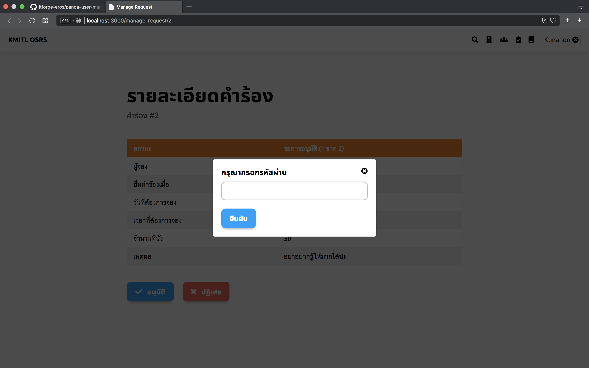

# Decline a request

*Exhibit A - Manage Request button*

*Exhibit B - All pending approval that you can approve*

*Exhibit C - Description of the request*

*Exhibit D - Approve and Decline button*

*Exhibit E - Password confirmation*
