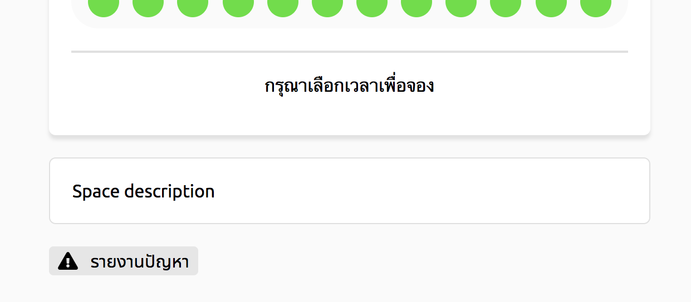
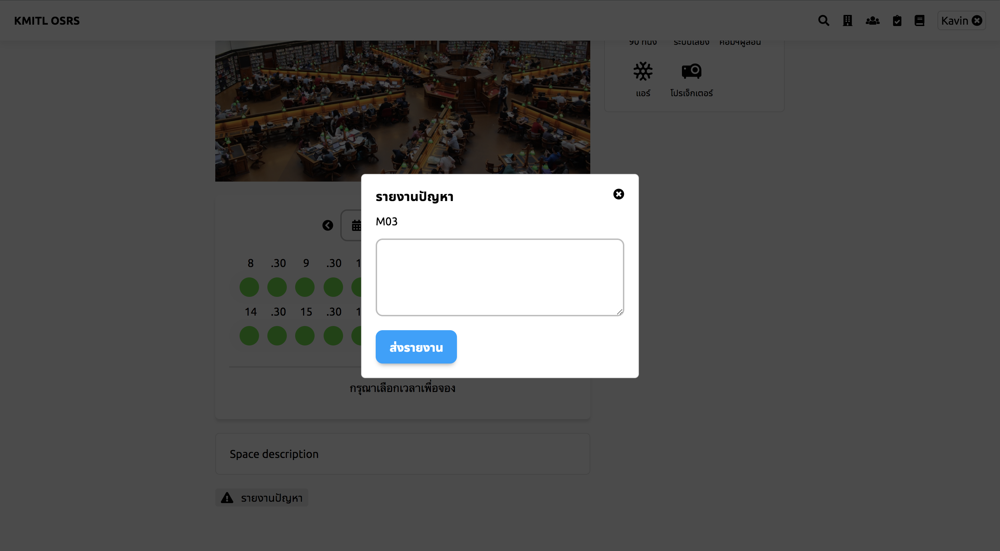

# แจ้งปัญหาของสถานที่

ก่อนจะแจ้งปัญหาของสถานที่ จะต้องกดค้นหาพื้นที่ที่จะรายงานก่อน โดยอ่านได้จากหัวข้อค้นหาสถานที่

## ขั้นที่ 1 - กดปุ่มรายงานปัญหา

## ขั้นที่ 2 - รายงานปัญหา
พิมพ์รายงานปัญหา และ กดส่งรายงาน เมื่อกดปุ่มรายงานปัญหา จะเข้าสู่หน้าการกรอกเอกสารรายงานปัญหา

หมายเหตุ: รายงานนี้จะถูกส่งไปให้ผู้ดูแลระบบ
