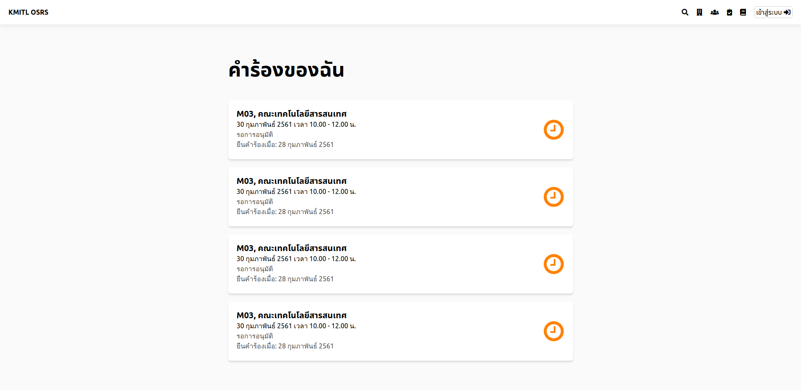

# จองสถานที่

## ขั้นที่ 1 - เริ่มจากค้นหาห้องที่ว่าง และ เลือกเวลาที่จะจอง
ใต้รูปห้อง จะมีบัตรการจอง 
กดลูกศรซ้าย-ขวา เพื่อเปลี่ยนวัน หรือ กดที่ปฏิทินเพื่อเลือกวันเฉพาะ

เลือกเวลาโดบกดที่วงกลมสีเขียวซึ่งแสดงว่าสามารถจองได้ แล้ววงกลมจะเปลี่ยนเป็นสีฟ้า 
วงกลมสีแดงหมายความว่า ไม่สามารถจองได้ ในช่วงเวลานั้น

คุณไม่สามารถจอง 9:00 ถึง 9:30 **และ** 10:00 ถึง 11:00 ในหนึ่งการจอง. คุณต้องจองใหม่อีกครั้งถ้าเป็นช่วงเวลาที่ไม่ต่อเนื่องกัน.

เลือกวงกลม 9 เพื่อจองช่วงเวลา 9:00 ถึง 9:29.  
ถ้าต้องการจองในช่วงเวลา 9:00 ถึง 12:00, กดวงกลม 9 และ 11.30 ตามรูปด้านล่าง.

กดปุ่มจองเพื่อเริ่มกระบวนการจอง

## ขั้นที่ 2 - เริ่มกระบวนการจอง
การจองส่วนมากต้องการมากกว่าวันที่ เวลา และสถานที่ ในการจองจำเป็นต้องมีเหตุผลในการจองด้วย. นี่เป็นส่วนสำคัญในการตัดสินใจอนุมัติของผู้อนุมัติ

บางพื้นที่ต้องการข้อมูลของผู้จองด้วย เช่น เบอร์โทรศัพท์ .ซึ่งข้อมูลเหล่านี้จะถูกกรอกอัตโนมัติ โดยใช้ข้อมูลผู้ใช้. ข้อมูลทั้งหมดนี้จะถูกเก็บไว้ใน log

กรอกเอกสารการจอง เสร็จแล้วกดปุ่ม ส่งข้อมูล, ผู้ใช้สามารถยกเลิกการจองได้ตามเงื่อนไขของพื้นที่นั้นๆ

## ขั้นที่ 3 - รอการอนุมัติ
เมื่อได้รับการอนุมัติ จะสามารถใช้ห้องที่จองได้ตามเวลาที่จอง โดยไม่ต้องทำอะไรเพิ่มอีก

